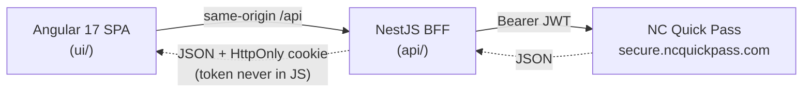

# HOV Dashboard

A personal dashboard for [NC Quick Pass](https://www.ncquickpass.com/) that shows your
**I-77 Express Lanes (HOV) toll activity grouped into trips**, and lets you manage your
**HOV declarations** (view current status, set a custom end date/time, and cancel) — all
from a single page.

> Unofficial, personal-use project. Not affiliated with or endorsed by NC Quick Pass or
> the North Carolina Turnpike Authority.

## Architecture



The **NestJS backend-for-frontend (BFF)** exists for two reasons:

1. **CORS** — NC Quick Pass's API does not permit third-party browser origins, so the SPA
   cannot call it directly. The BFF proxies every call server-to-server.
2. **Token security** — the BFF holds the NCQP bearer token in a signed, `HttpOnly`, `Secure`
   cookie, so JavaScript never reads it and it is never exposed to the SPA (see [Security](#security)).

## Features (single "Dashboard" page)

- **HOV status per vehicle** — each transponder with its current declaration status
  (Active / Submitted / None), a `datetime-local` picker to set the HOV **end date/time**,
  and a **Cancel** button for any active declaration.
- **I-77 HOV trips** — your toll activity filtered to the I-77 Express Lanes
  (`exitLocation` containing `77 EL`), grouped into **trips**: any tolls within **5 minutes**
  of each other are one trip. Each trip shows the time span and **total amount**, and expands
  (accordion) to list every individual toll.
- **Weekly HOV scheduling** (opt-in) — a per-vehicle Monday–Sunday schedule (multiple time
  ranges per day, or "All Day") that automatically creates future-dated NCQP declarations. A
  daily background job keeps a rolling ~7-day horizon filled even while you're logged out. Ad-hoc
  declarations still work, and overlaps with a scheduled window prompt you to cancel the
  scheduled one in favor of the ad-hoc.

## Running locally

Prerequisites: Node 22+, npm, and a Postgres database. The easiest Postgres is the
compose `db` service (published on `localhost:5432`); `api/.env.example` already
points `DATABASE_URL` at it.

```bash
# 0. Start a local Postgres (or point DATABASE_URL at your own)
docker compose up -d db

# 1. API (BFF) — http://localhost:3000
cd api
cp .env.example .env        # DATABASE_URL already targets the compose db
npm install
npm run start:dev           # applies migrations, then serves

# 2. UI (SPA) — http://localhost:4200  (proxies /api → :3000)
cd ui
npm install
npm start
```

Then open http://localhost:4200 and log in with your NC Quick Pass credentials.

## Running with Docker

The whole stack ships as three containers: Postgres (`db`), the NestJS BFF (`bff`),
and nginx (`web`). The `web` container serves the built SPA **and** reverse-proxies
`/api` to the BFF, so the browser talks to a single origin (the HttpOnly cookie
stays same-site and there's no CORS to configure).

```bash
docker compose up --build
# open http://localhost:8080
```

Only the `web` container is published (`:8080`); the BFF and DB are reachable only on
the internal compose network. For anything beyond local use, set a strong cookie secret
(and enable Secure cookies behind HTTPS):

```bash
COOKIE_SECRET=$(openssl rand -hex 32) COOKIE_SECURE=true docker compose up --build
```

> **Upgrading from an older SQLite build?** The `ncquickpass-data` volume now holds
> Postgres data — Postgres won't initialize over the old SQLite file. Reset it first:
> `docker compose down -v && docker compose up --build`.

| Service | Image base    | Role                                              |
| ------- | ------------- | ------------------------------------------------- |
| `db`    | `postgres`    | Persistent Postgres database (not published)      |
| `bff`   | `node`        | NestJS backend-for-frontend (not published)       |
| `web`   | `nginx`       | Serves the Angular SPA + proxies `/api` → `bff`   |

## Deployment

Production runs on AWS as a **single Lambda container** (the NestJS API also serves
the Angular SPA, same-origin) behind **CloudFront**, with **Neon** (serverless
Postgres) as the database and **EventBridge Scheduler** driving the daily reconcile.
Live at **https://ncquickpass.go-volare.com**.

CI/CD (`.github/workflows/`):

- **Push to `main`** → `build.yml` runs tests, builds the combined image to ECR, and
  drafts a GitHub Release. Nothing deploys.
- **Publish that Release** → `release.yml` applies pending Prisma migrations, syncs the
  `DATABASE_URL` secret onto the Lambda, deploys the released image, and promotes `:latest`.

Full one-time AWS bootstrap (ECR, Lambda, OIDC role, CloudFront, KMS, EventBridge,
Neon) is in [`docs/deployment.md`](./docs/deployment.md).

## Project layout

| Path        | What it is                                              |
| ----------- | ------------------------------------------------------- |
| `api/`  | NestJS BFF: auth (cookie session) + NCQP proxy endpoints |
| `ui/`   | Angular 17 standalone SPA: login + dashboard            |

## Security

- **Login token** — kept in a signed, `HttpOnly`, `Secure` cookie set by the BFF; JavaScript
  never sees it and it's never sent to the SPA. Set a strong `COOKIE_SECRET` for signing.
- **Credentials** — used only for the single login request and **not stored** — the one exception
  is opt-in weekly scheduling, where they're encrypted (AWS KMS in prod via `CREDENTIAL_KEY`; a
  local AES-256-GCM key in dev). The scheduler decrypts them transiently in memory to obtain a
  session token; they're never logged, never returned to the browser, and deleted when you remove
  your schedule. A background job must decrypt without you present, so this isn't zero-knowledge —
  which is why it's open source and auditable. The in-app **How it works** page (`/how-it-works`)
  walks through it with a diagram.
- **Reverse-engineered API** — endpoints were mapped from observed browser traffic and may change
  if NC Quick Pass updates their site.

## License

[MIT](./LICENSE)
