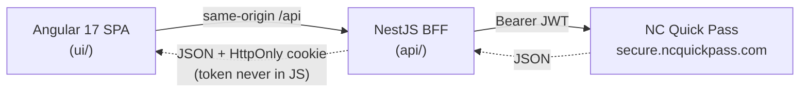

# HOV Dashboard

A personal dashboard for [NC Quick Pass](https://www.ncquickpass.com/) that shows your
**I-77 Express Lanes (HOV) toll activity grouped into trips**, and lets you manage your
**HOV declarations** (view current status, set a custom end date/time, and cancel) — all
from a single page.

> Unofficial, personal-use project. Not affiliated with or endorsed by NC Quick Pass or
> the North Carolina Turnpike Authority.

## Architecture



The **NestJS backend-for-frontend (BFF)** exists for two reasons:

1. **CORS** — NC Quick Pass's API does not permit third-party browser origins, so the SPA
   cannot call it directly. The BFF proxies every call server-to-server.
2. **Token security** — on login the BFF obtains the NCQP bearer token and stores it in a
   **signed, `HttpOnly`, `Secure` cookie**. The token lives in your browser but JavaScript
   can never read it, and it is never exposed to the SPA. **By default your username and
   password are used only for the single login request and are not stored.** The one exception
   is opt-in **weekly scheduling** (below): if you enable it, your credentials are stored
   encrypted so the background job can act while you're away — see
   [how scheduling protects your credentials](#how-scheduling-protects-your-credentials).

## Features (single "Dashboard" page)

- **HOV status per vehicle** — each transponder with its current declaration status
  (Active / Submitted / None), a `datetime-local` picker to set the HOV **end date/time**,
  and a **Cancel** button for any active declaration.
- **I-77 HOV trips** — your toll activity filtered to the I-77 Express Lanes
  (`exitLocation` containing `77 EL`), grouped into **trips**: any tolls within **5 minutes**
  of each other are one trip. Each trip shows the time span and **total amount**, and expands
  (accordion) to list every individual toll.
- **Weekly HOV scheduling** (opt-in) — a per-vehicle Monday–Sunday schedule (multiple time
  ranges per day, or "All Day") that automatically creates future-dated NCQP declarations. A
  daily background job keeps a rolling ~7-day horizon filled even while you're logged out. Ad-hoc
  declarations still work, and overlaps with a scheduled window prompt you to cancel the
  scheduled one in favor of the ad-hoc.

## How scheduling protects your credentials

The unattended scheduler has to act while you're away, so — only if you opt in — your NC Quick
Pass credentials are stored encrypted:

- Stored **only** when you enable a weekly schedule and re-enter your password to authorize it.
- Encrypted with **AWS KMS** in production (`CREDENTIAL_KEY_ARN`): the key never leaves KMS, the
  app only holds ciphertext, and the KMS key policy grants decryption to the scheduler's IAM role
  alone — no human principals. Every decrypt is logged to CloudTrail with the tenant's account as
  encryption context. A local AES-256-GCM key (`SCHEDULE_ENCRYPTION_KEY`) is available for dev.
- Decrypted only transiently in memory to obtain a session token, never logged in plaintext,
  never returned to the browser, and deleted when you remove your schedule.

Because a background job must decrypt without you present, a truly zero-knowledge design isn't
possible here — which is exactly why the implementation is open source and auditable. The in-app
**How it works** page (`/how-it-works`) explains this with a diagram.

## Running locally

Prerequisites: Node 20+ and npm.

```bash
# 1. API (BFF) — http://localhost:3000
cd api
cp .env.example .env        # adjust if needed
npm install
npm run start:dev

# 2. UI (SPA) — http://localhost:4200  (proxies /api → :3000)
cd ui
npm install
npm start
```

Then open http://localhost:4200 and log in with your NC Quick Pass credentials.

## Running with Docker

The whole stack ships as two containers. The frontend's nginx serves the built SPA
**and** reverse-proxies `/api` to the BFF, so the browser talks to a single origin
(the HttpOnly cookie stays same-site and there's no CORS to configure).

```bash
docker compose up --build
# open http://localhost:8080
```

Only the `web` container is published (`:8080`); the BFF is reachable only on the
internal compose network. For anything beyond local use, set a strong cookie secret
(and enable Secure cookies behind HTTPS):

```bash
COOKIE_SECRET=$(openssl rand -hex 32) COOKIE_SECURE=true docker compose up --build
```

| Service | Image base    | Role                                              |
| ------- | ------------- | ------------------------------------------------- |
| `web`   | `nginx`       | Serves the Angular SPA + proxies `/api` → `bff`   |
| `bff`   | `node`        | NestJS backend-for-frontend (not published)       |

## Project layout

| Path        | What it is                                              |
| ----------- | ------------------------------------------------------- |
| `api/`  | NestJS BFF: auth (cookie session) + NCQP proxy endpoints |
| `ui/`   | Angular 17 standalone SPA: login + dashboard            |

## Security notes

- Credentials are POSTed once to the BFF over HTTPS and forwarded to NCQP; they are **not**
  persisted — the sole exception is opt-in weekly scheduling, where they are stored encrypted
  (see [How scheduling protects your credentials](#how-scheduling-protects-your-credentials)).
- The NCQP JWT is held only in an `HttpOnly`, `Secure`, signed session cookie set by the BFF.
- Set a strong `COOKIE_SECRET` in `api/.env` for signing.
- The API surface was mapped from observed browser traffic; endpoint behavior may change if
  NC Quick Pass updates their site.

## License

[MIT](./LICENSE)
